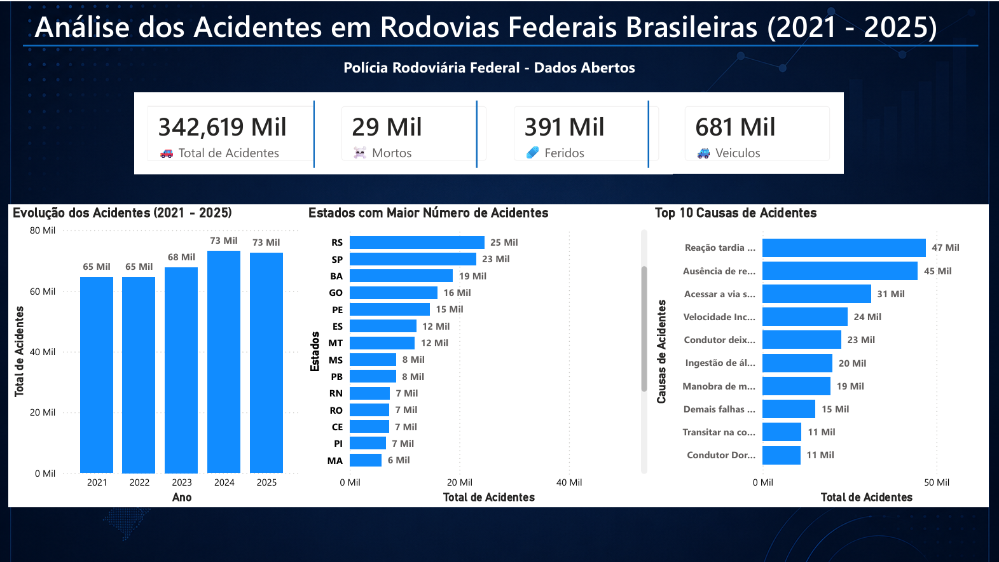

# 📊 Projeto Aplicado I – Análise de Acidentes em Rodovias Federais Brasileiras (2021–2025)

> Projeto desenvolvido na disciplina de Projeto Aplicado I do curso de Tecnologia em Banco de Dados da Universidade Presbiteriana Mackenzie, utilizando dados públicos da Polícia Rodoviária Federal (PRF) para identificar padrões de acidentes nas rodovias federais brasileiras entre os anos de 2021 e 2025.

---

## 📷 Dashboard




> Dashboard desenvolvido em Power BI como complemento ao Projeto Aplicado I, consolidando os principais resultados da Análise Exploratória de Dados realizada com Python.
---

# 🎥 Apresentação em Vídeo

A apresentação final do projeto está disponível no YouTube.

🔗 https://youtu.be/PHAlXFOS2GE

Durante a apresentação são abordados:

- Contextualização do problema;
- Objetivos da pesquisa;
- Fonte e estrutura dos dados;
- Análise Exploratória de Dados (AED);
- Principais resultados obtidos;
- Considerações finais.

---

# 👥 Integrantes

- Francisco Freitas Dantas
- Felipe Magalhães de Melo Costa
- Gustavo Marcondes Modesto Freitas Arrebola

---

# 🎯 Objetivo

Analisar os registros de acidentes ocorridos nas rodovias federais brasileiras entre os anos de 2021 e 2025, buscando identificar padrões temporais, geográficos e comportamentais que possam contribuir para uma melhor compreensão das ocorrências registradas pela Polícia Rodoviária Federal.

---

# ❓ Problema de Pesquisa

Os acidentes registrados nas rodovias federais brasileiras apresentam padrões identificáveis relacionados ao tempo, localização, causas, condições meteorológicas, tipos de acidentes e gravidade das ocorrências?

---

# 📂 Base de Dados

**Fonte:**

Polícia Rodoviária Federal (PRF) — Dados Abertos

https://www.gov.br/prf/pt-br/acesso-a-informacao/dados-abertos

**Período analisado**

- 2021
- 2022
- 2023
- 2024
- 2025

**Quantidade aproximada de registros**

342.619 acidentes

**Natureza dos dados**

Dados públicos e anonimizados.

---

# 📊 Principais Análises Realizadas

Durante a Análise Exploratória de Dados (AED) foram desenvolvidas análises sobre:

- Evolução dos acidentes ao longo dos anos;
- Estados com maior número de acidentes;
- Principais causas dos acidentes;
- Tipos de acidentes mais frequentes;
- Condições meteorológicas;
- Fase do dia;
- Gravidade das ocorrências.

---

# 📈 Dashboard Interativo (Power BI)

Como contribuição complementar ao projeto e com o objetivo de aprofundar os estudos em Business Intelligence e visualização de dados, **Francisco Freitas Dantas** desenvolveu um dashboard interativo em **Power BI**, reunindo os principais indicadores obtidos durante a Análise Exploratória de Dados.

O dashboard apresenta:

- 📈 Evolução anual dos acidentes (2021–2025);
- 📍 Estados com maior número de acidentes;
- ⚠️ Top 10 causas dos acidentes;
- 🚗 Total de acidentes;
- ☠️ Número de mortos;
- 🩹 Número de feridos;
- 🚙 Quantidade de veículos envolvidos.

Os arquivos do dashboard encontram-se na pasta:

```text
powerbi/
```

Disponíveis nos formatos:

- Dashboard_PRF_2021_2025.pbix
- Dashboard_PRF_2021_2025.pdf

---

# 💡 Principais Insights

A análise permitiu identificar diversos padrões relevantes, entre eles:

- Crescimento gradual do número de acidentes ao longo do período analisado;
- Minas Gerais concentrou o maior número de ocorrências entre os estados brasileiros;
- Colisões traseiras figuram entre os tipos de acidentes mais frequentes;
- Grande parte dos acidentes ocorreu em condições de céu claro;
- O período diurno concentrou a maior quantidade de registros;
- A reação tardia ou ineficiente do condutor aparece entre as principais causas registradas;
- A maior parte das vítimas saiu ilesa ou sofreu ferimentos leves.

---

# 🛠️ Tecnologias Utilizadas

- Python
- Pandas
- Matplotlib
- Power BI
- Git
- GitHub
- R
- RStudio

---

# 📁 Estrutura do Projeto

```text
projeto-acidentes-rodovias/
│
├── data/
│   └── Bases da PRF (2021–2025)
│
├── scripts/
│   └── Tratamento e análise dos dados
│
├── graficos/
│   └── Gráficos gerados durante a AED
│
├── powerbi/
│   ├── Dashboard_PRF_2021_2025.pbix
│   ├── Dashboard_PRF_2021_2025.pdf
│   └── Dashboard_PRF_2021_2025.png
│
├── docs/
│   ├── Relatório
│   └── Slides da apresentação
│
└── README.md
```

---

# 🚀 Competências Desenvolvidas

Durante o desenvolvimento deste projeto foram aplicados conhecimentos em:

- Análise Exploratória de Dados (EDA);
- Limpeza e tratamento de dados;
- Visualização de dados;
- Storytelling com dados;
- Power BI;
- Programação em Python;
- Manipulação de dados com Pandas;
- Versionamento de código com Git;
- Organização de projetos utilizando GitHub.

---

# 📚 Considerações Finais

Este projeto proporcionou uma visão abrangente sobre os acidentes registrados nas rodovias federais brasileiras, demonstrando como técnicas de análise exploratória e visualização de dados podem transformar grandes volumes de informações em conhecimento útil para apoio à tomada de decisão.

Além das atividades previstas na disciplina, foi desenvolvido um dashboard interativo em Power BI como complemento ao projeto, permitindo consolidar os resultados da análise em uma interface visual e fortalecendo o aprendizado em ferramentas de Business Intelligence.

---

# 📄 Licença

Este projeto possui finalidade exclusivamente acadêmica e utiliza dados públicos disponibilizados pela Polícia Rodoviária Federal (PRF).
